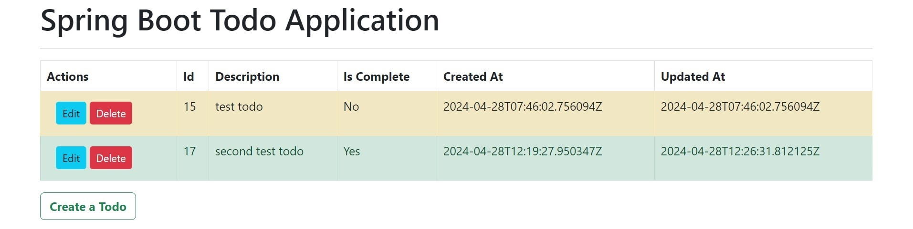

This is a simple Todo application built with Spring framework where users can add, edit, and delete their tasks.

<h2>Features</h2>
• Add Todo: Users can add new tasks to their list.

• Edit Todo: Users can modify existing tasks.

• Delete Todo: Users can remove tasks from their list.

<h2>Technologies Used </h2>

• Spring Framework: Used for building the backend logic and RESTful APIs.

• Java: Primary programming language for the backend.

• Spring Boot: Facilitates rapid application development and easy deployment.

• Hibernate: Object-relational mapping (ORM) tool for database interaction.

• MySQL: Database management system for storing todo items.

• Maven: Build automation tool for managing dependencies and building the project.

<h2>Usage</h2>

<h3>1.Add a Todo:</h3>

• Click on the "Create Todo" button.
• Enter the details of the new task.
• Click on the "Add Todo" button to add the task to the list.

<h3>2.Edit a Todo:</h3>

• Click on the "Edit" button on the task you want to edit.
• Modify the task details.
• Click on the "Update" button to update the changes.

<h3>3.Delete a Todo:</h3>

Click on the "Delete" button to remove the task from the list.
