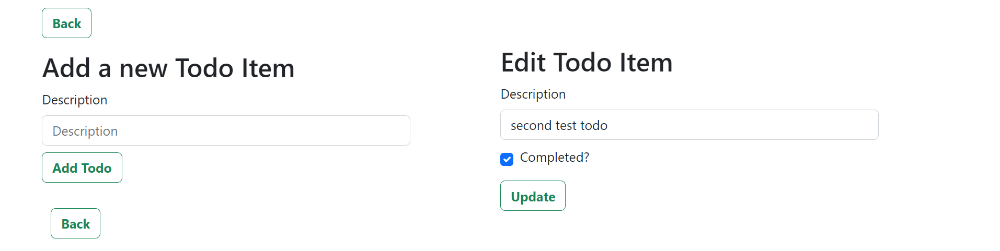

This is a simple Todo application built with Spring framework where users can add, edit, and delete their tasks.

<h2>Features</h2>
• Add Todo: Users can add new tasks to their list.

• Edit Todo: Users can modify existing tasks.

• Delete Todo: Users can remove tasks from their list.

<h2>Technologies Used </h2>

• Spring Framework: Used for building the backend logic and RESTful APIs.

• Java: Primary programming language for the backend.

• Spring Boot: Facilitates rapid application development and easy deployment.

• Hibernate: Object-relational mapping (ORM) tool for database interaction.

• MySQL: Database management system for storing todo items.

• Maven: Build automation tool for managing dependencies and building the project.

Installation & Setup Guide

Prerequisites
Before running the project, ensure you have the following installed on your system:

Java 17+ (JDK)

Maven (for dependency management)

MySQL (for the database)

An IDE (IntelliJ IDEA, Eclipse, or VS Code)

Git (optional, for cloning the repository)

Step 1: Clone the Repository
If you have Git installed, open a terminal and run:

git clone 
cd 

If you don’t have Git, download the project as a ZIP and extract it.

Step 2: Configure the Database

Open MySQL and create a new database:

CREATE DATABASE todo_db;

Open the application.properties or application.yml file in the project and configure the database connection:

spring.datasource.url=jdbc:mysql://localhost:3306/todo_db
spring.datasource.username=root
spring.datasource.password=yourpassword

spring.jpa.hibernate.ddl-auto=update
spring.jpa.show-sql=true

Make sure to replace yourpassword with your actual MySQL password.

Step 3: Build the Project
In the terminal, navigate to the project folder and run:

mvn clean install

This will download dependencies and compile the project.

Step 4: Run the Application
Start the application with:

mvn spring-boot:run

or if using an IDE, run the main method in TodoApplication.java.

Step 5: Access the Application
Once the application starts successfully, open your browser and go to:

http://localhost:8080

<h2>Usage</h2>

<h3>1.Add a Todo:</h3>

• Click on the "Create Todo" button.
• Enter the details of the new task.
• Click on the "Add Todo" button to add the task to the list.

<h3>2.Edit a Todo:</h3>

• Click on the "Edit" button on the task you want to edit.
• Modify the task details.
• Click on the "Update" button to update the changes.

<h3>3.Delete a Todo:</h3>

Click on the "Delete" button to remove the task from the list.
